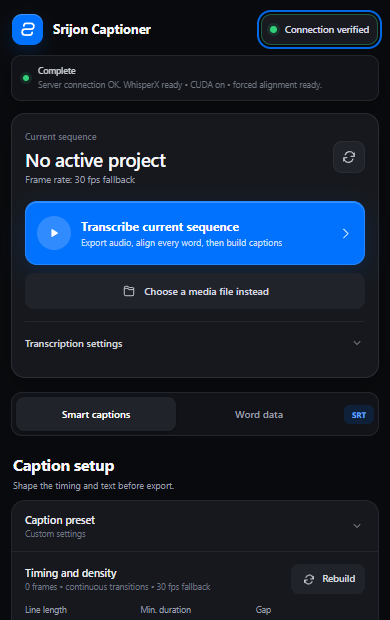
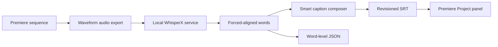

<div align="center">
  
  <h1>Srijon Captioner</h1>
  <p><strong>Local, word-aligned captions for Adobe Premiere Pro.</strong></p>
  <p>A polished UXP panel that exports sequence audio, transcribes it with WhisperX, builds deterministic captions, and brings revisioned SRT files back into the Premiere project.</p>

  
  
  
  [](LICENSE)
</div>



## Why it exists

Premiere's built-in transcription is convenient, but repeatable short-form caption workflows often need tighter control. Srijon Captioner keeps speech processing local, preserves real WhisperX forced-aligned word timestamps, and lets an editor rebuild caption phrasing without transcribing the media again.

## Highlights

- One-click active-sequence audio export and transcription
- Local WhisperX service with CPU and NVIDIA CUDA support
- Real forced-aligned word timing; no fabricated timing fallback
- Deterministic smart caption grouping with strict one- or two-line output
- Exact zero-gap handoffs between adjacent captions
- Punctuation, capitalization, custom term, duration, pause and density controls
- Persistent caption presets
- Raw word-level JSON export using `srijon-word-transcript-v1`
- Settings-aware, non-overwriting `r001`, `r002`, … delivery names
- Automatic SRT save beside the project and import into the Project panel
- Single-job safety guards, clear busy/error states and optional completion alerts
- Compact dark UI designed for a narrow docked Premiere panel

## How it works



Everything in the transcription path runs on the user's machine. The service listens only on `127.0.0.1:8765`; internet is needed only when dependencies or uncached model resources must be downloaded.

## Requirements

- Windows 10 or 11
- Adobe Premiere Pro 26.2 or newer
- Python 3.12 for the automated setup path
- Internet access for initial dependency and model downloads
- Optional NVIDIA GPU for faster CUDA transcription

## Install

### Release package

1. Download `Srijon-Captioner-v1.2.14-Final.ccx` from the repository's Releases page.
2. Clone or download this repository and run `setup\SETUP_ALL_NEW_DEVICE.bat` as administrator once. It creates an isolated runtime under `%LOCALAPPDATA%\SrijonCaptioner`, installs the required Python packages, verifies the service, and can install the extension through Adobe UPIA.
3. Open Premiere Pro, then choose **Window → UXP Plugins → Srijon Captioner**.

The first transcription with a large model can download several gigabytes. Language-specific alignment assets may also download the first time a language is used.

### Existing WhisperX installation

Run `setup\CONFIGURE_EXISTING_WHISPERX.bat`, enter the existing Python executable and model-cache paths, then build and install:

```bat
setup\BUILD_CCX.bat --version 1.2.14 --name Srijon-Captioner-v1.2.14-Final.ccx
setup\CLEAN_REINSTALL_PLUGIN.bat
```

See [Installation](docs/INSTALLATION.md) and [Troubleshooting](docs/TROUBLESHOOTING.md) for detailed guidance.

## Daily workflow

1. Open a saved Premiere project and active sequence.
2. Select the transcription model, language and compute settings.
3. Click **Transcribe current sequence**. The extension exports audio, starts the local service when needed, transcribes, force-aligns and caches the result.
4. Shape the captions with timing, line, punctuation and capitalization controls. **Rebuild** uses the cached transcript and does not run WhisperX again.
5. Click **Auto-save + Import**. The SRT is stored under `Srijon Captioner Audio\Captions` beside the project and imported into the Project panel.
6. Drag the imported SRT onto the timeline to create a native caption track.

Premiere's current UXP API does not expose a supported way to populate a native caption track, so the final drag from the Project panel is intentionally still a user action.

## Output naming

Deliveries encode major caption settings, include a stable configuration hash, and never overwrite an earlier result. Rebuilding the same configuration five times produces `r001` through `r005`; changing the settings starts a separate revision family.

```text
<project folder>\
└── Srijon Captioner Audio\
    ├── Captions\
    │   └── Sequence_single_32c_1s_gap0_8f31c2_r001.srt
    └── Word Data\
        └── Sequence_words_4d29a1_r001.json
```

## Develop and validate

The feature contracts are deliberately explicit because timing regressions can be subtle. Read these files before changing behavior:

1. [AI agent handoff](docs/AI_AGENT_HANDOFF.md)
2. [Feature contract](docs/FEATURE_CONTRACT.md)
3. [Architecture](docs/ARCHITECTURE.md)
4. [Word JSON schema](docs/WORD_JSON_SCHEMA.md)
5. [Project state](docs/PROJECT_STATE.json)

Then run:

```bat
setup\VALIDATE_PROJECT.bat
setup\BUILD_CCX.bat --version 1.2.14 --name Srijon-Captioner-v1.2.14-Final.ccx
```

Primary source lives in `source/premiere-plugin`. The standalone service mirror in `source/whisper-server` must remain byte-for-byte synchronized with the bundled `server.py`.

## Project map

| Path | Purpose |
| --- | --- |
| `source/premiere-plugin/` | UXP panel, Premiere integration and bundled local service |
| `source/whisper-server/` | Standalone/debug service mirror and dependency files |
| `setup/` | Bootstrap, build, verify, install and uninstall scripts |
| `tools/` | Validation, packaging and runtime helpers |
| `docs/` | Contracts, architecture, guides and design system |
| `examples/` | Example machine-readable transcript output |

The reusable [extension UI/UX design system](docs/EXTENSION_UI_UX_DESIGN_SYSTEM.md) documents the visual and interaction language used by this panel for future UXP or CEP projects.

## Privacy and security

- Media is processed locally and is not uploaded by this project.
- The API binds to loopback only.
- The extension launches only bundled `.bat`/`.vbs` helpers and the configured local Python runtime.
- User settings and presets remain local.

Please report security issues privately as described in [SECURITY.md](SECURITY.md). Additional details are in [Security and privacy notes](docs/SECURITY_AND_PRIVACY.md).

## Contributing

Bug reports and focused improvements are welcome. Read [CONTRIBUTING.md](CONTRIBUTING.md) before opening a pull request, and preserve every invariant in [docs/FEATURE_CONTRACT.md](docs/FEATURE_CONTRACT.md).

## License

Srijon Captioner is released under the [MIT License](LICENSE). Adobe Premiere Pro, WhisperX, PyTorch, FFmpeg and other dependencies remain subject to their own licenses; see [third-party notices](docs/THIRD_PARTY_NOTICES.md).
